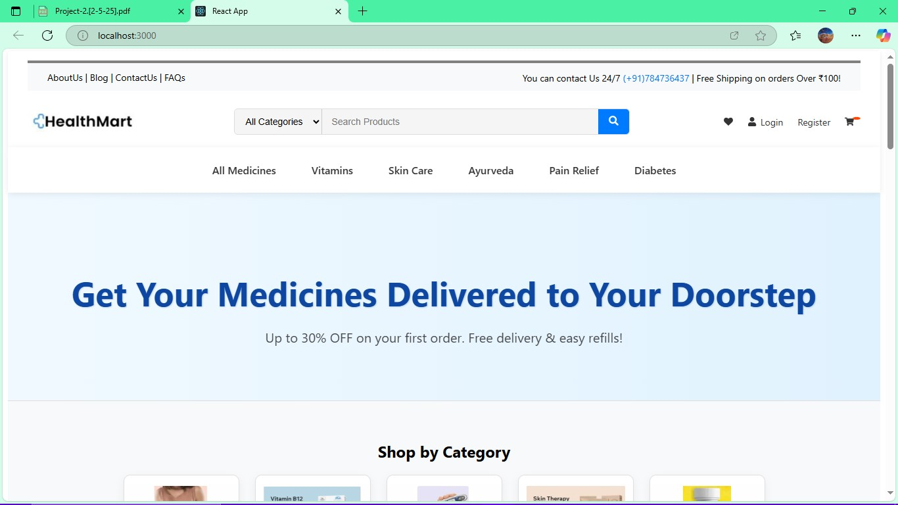
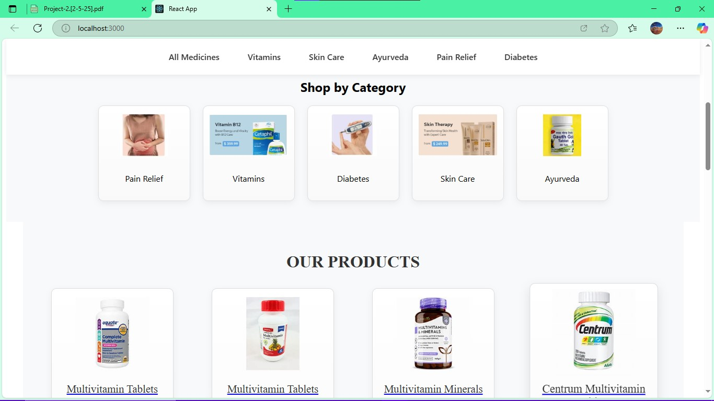
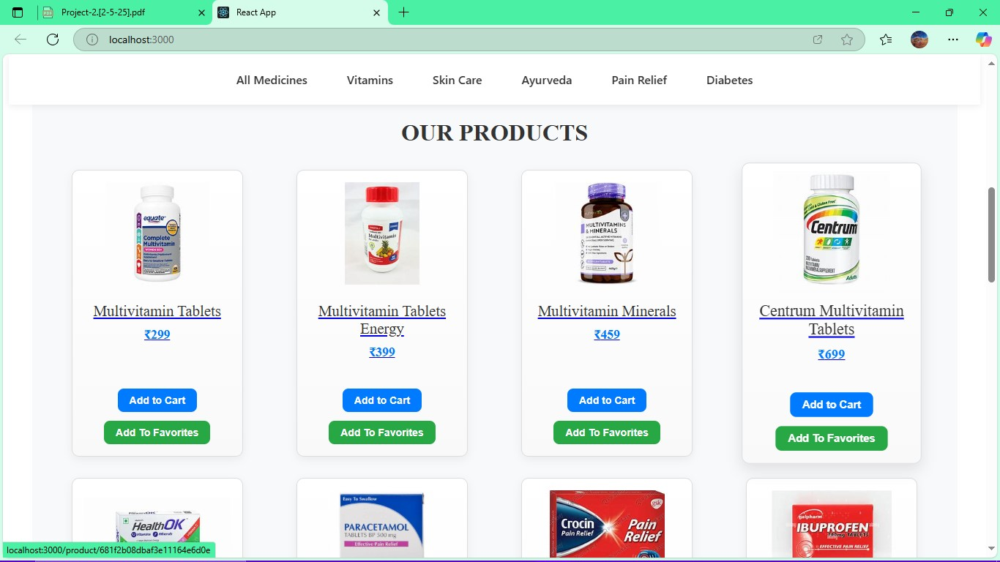
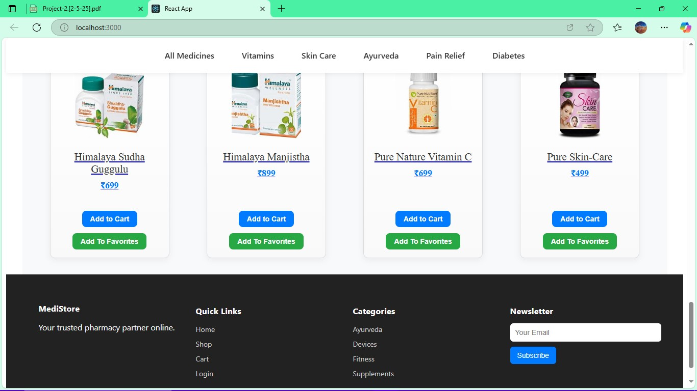
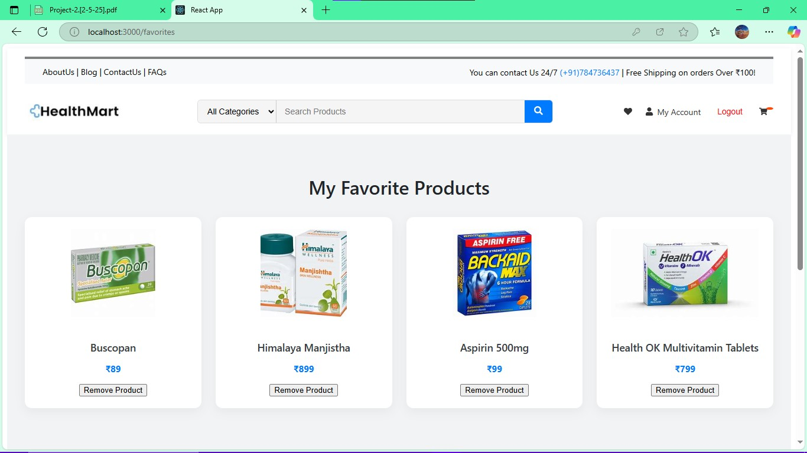
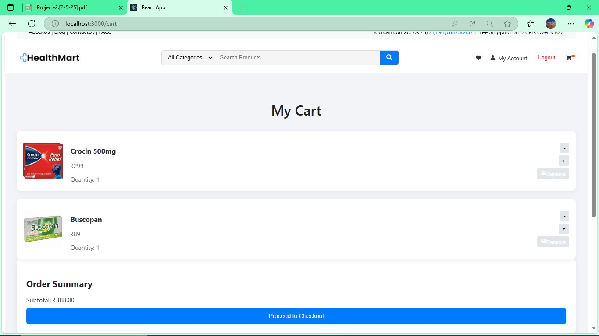
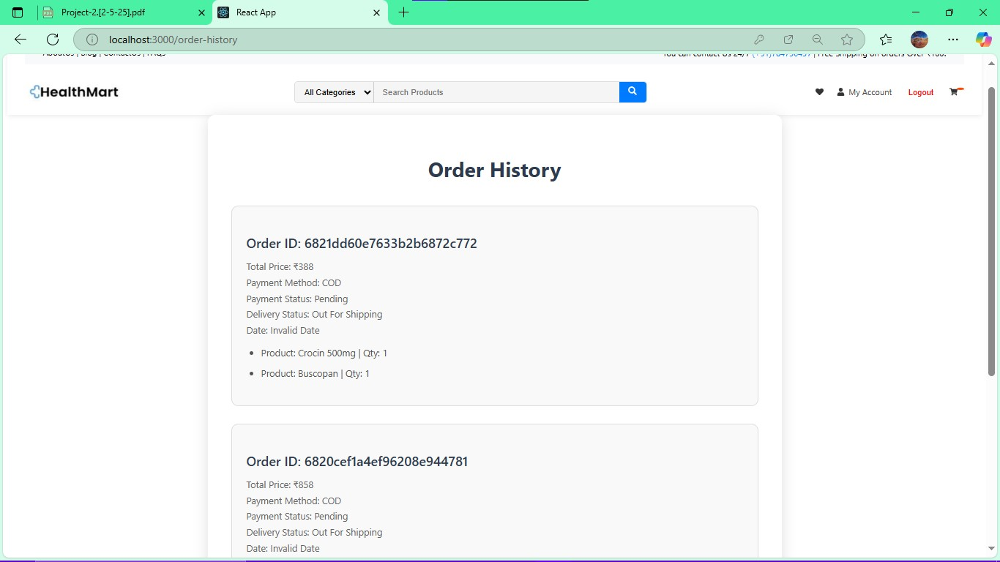
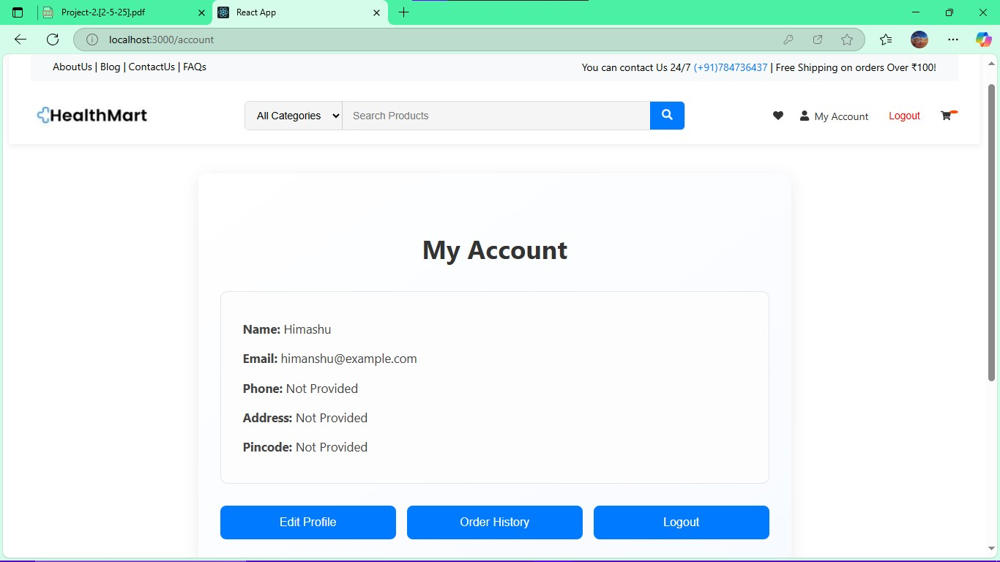

# 🏥 Online Medical Store - MERN Stack Project

## Author: SachinKumarYadav

A full-stack eCommerce application for an online medical store built using the MERN Stack (MongoDB, Express, React, Node.js). Users can browse medicines, manage carts, place orders, and view their order history. Admins have access to manage inventory and orders.

## 🗂 Project Structure
project-root/
├── server/                     # Backend (Express + MongoDB)
│   ├── config/                # DB connection and environment config
│   ├── controllers/           # Business logic handlers
│   ├── middlewares/           # Auth and error handling
│   ├── models/                # Mongoose schemas
│   ├── routes/                # API endpoints
│   ├── utils/                 # Helper functions
│   ├── .env                   # Environment variables
│   ├── server.js              # Server entry point
│   ├── package.json
│   └── package-lock.json
│
├── client/                    # Frontend (React)
│   ├── public/                # Static assets
│   ├── src/
│   │   ├── components/        # Reusable UI components
│   │   ├── context/           # Context API (Auth, Cart, etc.)
│   │   ├── pages/             # Pages (Home, Products, etc.)
│   │   ├── reducers/          # Reducers for state management
│   │   ├── styles/            # Component CSS
│   │   └── App.js             # Main component
│   ├── package.json
│   └── package-lock.json

## 💻 Technologies Used
### Frontend:
•React.js (with Hooks, Context API, useReducer)
•HTML5, CSS3
•Axios (for API communication)
•React Router DOM
### Backend:
•Node.js
•Express.js
•MongoDB + Mongoose
•JWT Authentication
•bcrypt (password hashing)
•dotenv (environment config)
•CORS (Cross-Origin Resource Sharing)

## 🌟 Key Features
### 🧑‍⚕ Frontend - User Interface
Responsive Design
•User Pages:
•Home
•Browse Medicines
•Product Details
•Add/Update/Remove Cart Items
•Checkout
•Login & Register
•Order History
•User Profile

### 🔐 Backend - 
Server Side
•JWT-Based Authentication
•Product CRUD (Admin Only)
•Cart & Order Management
•Role-Based Access (Admin vs User)

## 📦 Database - 
### MongoDB Stores:
•Users
•Medicines (Products)
•Cart Items
•Orders
•Categories

## 🚀 Setup Instructions
1. Clone the Repository
bash
Copy code
git clone https://github.com/your-username/online-medical-store.git
cd online-medical-store

2. Install Backend Dependencies
bash
Copy code
cd server
npm install

3. Create .env in /server
ini
Copy code
PORT=5000
MONGO_URI=your_mongodb_connection_string
JWT_SECRET=your_secret_key

4. Start Backend Server
bash
Copy code
node server.js
or use:
npx nodemon server.js

5. Install Frontend Dependencies
bash
Copy code
cd ../client
npm install

6. Start Frontend
bash
Copy code
npm start

## 🌐 Usage
Frontend: http://localhost:3000
Backend API: http://localhost:5000
RESTful APIs are used for user authentication, product handling, and order management.

## 📸 Screenshots
#### **HomePage**

#### **Homepage Content**

#### **Homepage Content**

#### **Homepage Content Footer**

#### **Favorites Page**

#### **My Cart Page**

#### **User Order History Page**

#### **User Account Page**

🌍 Deployment (Optional)
Frontend: Vercel 
Backend: Render 

## 👤 Author
### SachinKumarYadav
### GitHub: @BleedingEdge2004